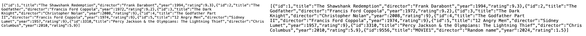

# MovieListApp 🎬

MovieListApp is an iOS application designed to provide movie enthusiasts with a curated list of movies. The app fetches data from a custom RESTful API deployed on Microsoft Azure, offering a sleek, user-friendly interface for browsing and managing a personal movie collection.

## How it looks
 
 
 Below displays movie data being inputted into as JSON through Azure API:
 
 
## Features

- Browse a list of movies fetched from a custom API.
- View detailed information about each movie.
- Add new movies to your personal list.
- Cross-platform compatibility with iOS devices.

## How it is made
- Languages: Swift, C#, HTML/CSS
- Frameworks & Tools: Azure AppService, XCode, Visual Studios

## Prerequisites

Before you begin, ensure you have met the following requirements:

- You have installed the latest version of Xcode.
- You have access to my custom-made RESTful API

## Installation

To install MovieListApp, follow these steps:

1. Clone the repository to your local machine via command:
  
   ```git clone https://github.com/yourusername/MovieListApp.git```

2. Open the `MovieList.xcodeproj` file in Xcode.
3. Configure the project with your own signing capabilities to run on your iOS device or simulator.
4. Ensure that the deployment of the custom API is activated: [https://movie-db-api.azurewebsites.net/movies](url)
